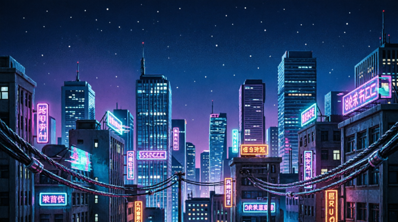

  <!-- GANTI 'city_banner.png' DENGAN NAMA FILE GAMBAR YANG LO UPLOAD -->
  

<h1 align="center">
  <!-- Font Pixel "Press Start 2P" biar vibes retro-nya dapet -->
  
</h1>

 

  🌃 <b>Currently hacking from:</b> MacBook Pro 2009 (El Capitan Survivor)  
  💻 <b>Stack:</b> Python, Node.js, Bash, & Pure Logic  
  🎮 <b>Hobby:</b> Retro Gaming, Open-Source, & Bypassing Cloudflare

 

<h2 align="center">📊 System Statistics</h2>

  <!-- GANTI 'USERNAME_GITHUB_LO' dengan username asli lo -->
  
  

 

<h2 align="center">🛠️ Tech Arsenal</h2>

  
  
  
  

 

  <i>"Code is poetry, but terminal is the canvas."</i>

